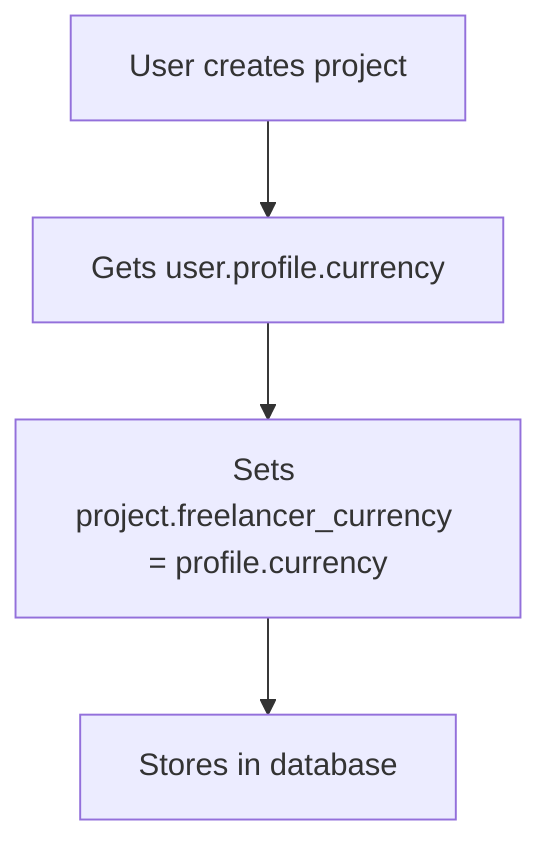
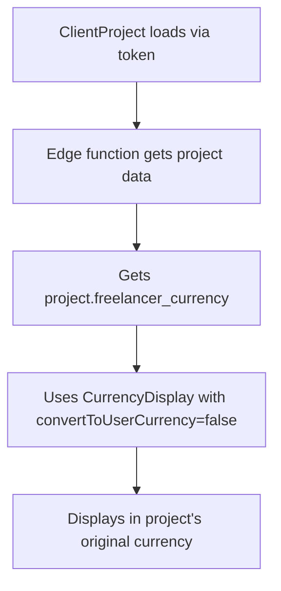

# 💰 Currency System Components Analysis

## 🎯 Core Currency Components

### 1. **Currency Display Components**
```typescript
// 📁 src/components/ui/currency-display.tsx
├── CurrencyDisplay        // Main component with optional conversion
├── CurrencyAmount        // Simple display, no conversion  
├── ConvertibleAmount     // Always converts to user currency
└── ProjectCurrencyDisplay // Project-specific display logic
```

### 2. **Currency Hooks**
```typescript
// 📁 src/hooks/
├── useCurrencyDisplay.ts      // Main display hook with conversion
├── useUserCurrency.ts         // User's preferred currency
├── useProjectCurrency.ts      // Project-specific currency logic
└── useDashboard.ts           // Includes currency in dashboard context
```

### 3. **Currency Services**
```typescript  
// 📁 src/services/core/
├── ConversionService.ts              // Currency conversion logic
├── ExchangeRateService.ts           // Exchange rate fetching
├── CurrencyConversionCoordinator.ts // Batch conversion coordination
└── CurrencyService.ts               // General currency utilities
```

### 4. **Currency Utilities**
```typescript
// 📁 src/lib/
├── currency.ts          // Core currency types and formatting
├── currency-temp.ts     // Temporary currency utilities  
└── currency-expanded.ts // Extended currency definitions
```

---

## 🏗️ Project Page Currency Usage

### **ProjectManagement.tsx** 🔧
```typescript
// 📍 Current Implementation (Line 129)
const projectCurrency = project.freelancer_currency || 'USD';

// 🎯 Usage Locations:
├── Line 155: formatCurrency(totalValue, projectCurrency)      // Total Value Card
├── Line 165: formatCurrency(completedValue, projectCurrency)  // Completed Value Card  
├── Line 184: userCurrency={projectCurrency}                  // ProjectHeader prop
└── Line 201: userCurrency={projectCurrency}                  // MilestoneList prop
```

### **ClientProject.tsx** 🌐  
```typescript
// 📍 Current Implementation (Line 118)
const projectCurrency = project.freelancer_currency || 'USD';

// 🎯 Usage Locations:
├── Line 446: convertToUserCurrency={false}                   // Stats CurrencyDisplay
├── Line 594: convertToUserCurrency={false}                   // Milestone CurrencyDisplay
└── PDF Generation: Uses projectCurrency in contract PDF
```

---

## 🗄️ Database Currency Fields

### **Projects Table Schema**
```sql
-- ❌ Missing: projects.currency (doesn't exist in database)
-- ✅ Available: projects.freelancer_currency (user's profile currency)

-- Current Reality:
freelancer_currency TEXT DEFAULT 'USD'  -- Set from user profile during creation
```

### **Profiles Table Schema**
```sql
-- ✅ User's preferred currency
currency TEXT DEFAULT 'USD'  -- User's dashboard preference
```

---

## 🔄 Currency Flow in Project Pages

### **Creation Flow**


### **Display Flow - ProjectManagement**
```mermaid  
graph TD
    A[ProjectManagement loads] --> B[Gets project.freelancer_currency]
    B --> C[Uses formatCurrency(amount, projectCurrency)]
    C --> D[Displays in project's original currency]
```

### **Display Flow - ClientProject**


---

## 📊 Currency Components Usage Matrix

| Component | ProjectManagement | ClientProject | Dashboard | Other Pages |
|-----------|------------------|---------------|-----------|-------------|
| **formatCurrency()** | ✅ Direct use | ❌ Not used | ✅ Used | ✅ Used |
| **CurrencyDisplay** | ❌ Not used | ✅ Used | ✅ Used | ✅ Used |
| **userCurrency hook** | ❌ Not used | ❌ Not used | ✅ Used | ✅ Used |
| **Project currency** | ✅ freelancer_currency | ✅ freelancer_currency | 🔄 Converts | 🔄 Mixed |

---

## ⚠️ Key Issues & Solutions

### **Issue 1: Missing project.currency field**
```typescript
// ❌ Code tries to access non-existent field
const projectCurrency = project.currency || project.freelancer_currency || 'USD';

// ✅ Fixed to use actual schema
const projectCurrency = project.freelancer_currency || 'USD';
```

### **Issue 2: Different currency sources**
```typescript
// ❌ Before: ProjectManagement used user currency, ClientProject used project currency

// ✅ After: Both use the same project currency source  
const projectCurrency = project.freelancer_currency || 'USD';
```

### **Issue 3: Conversion inconsistency**
```typescript
// ✅ Both pages now use NO conversion
// ProjectManagement: formatCurrency(amount, projectCurrency) // No conversion
// ClientProject: <CurrencyDisplay convertToUserCurrency={false} /> // No conversion
```

---

## 🎯 Current State (After Fixes)

### **✅ Consistent Behavior**
- Both ProjectManagement and ClientProject show **same currency**
- Both use `project.freelancer_currency` as source
- Both display amounts without conversion
- New projects will work correctly with chosen currency

### **✅ Simplified Logic**
```typescript
// Simple, consistent currency logic across project pages:
const projectCurrency = project.freelancer_currency || 'USD';
```

### **✅ Data Flow**
```
User Profile Currency (AUD) 
    ↓ 
Project Creation 
    ↓
project.freelancer_currency = 'AUD'
    ↓
Both Pages Display: A$120.00
```

---

## 📋 Components That Need Currency

### **High Priority (Project Related)**
1. **ProjectManagement.tsx** - ✅ Fixed
2. **ClientProject.tsx** - ✅ Fixed  
3. **ProjectCard components** - 🔄 May need review
4. **MilestoneList components** - 🔄 May need review

### **Medium Priority (Dashboard)**
1. **Dashboard.tsx** - 🔄 Uses conversion (different logic)
2. **DashboardStats.tsx** - 🔄 Uses conversion  
3. **Projects.tsx** - 🔄 Uses conversion

### **Low Priority (Other)**
1. **Invoice pages** - 🔄 Different currency logic needed
2. **Analytics pages** - 🔄 Different currency logic needed
3. **Profile pages** - 🔄 User currency management
