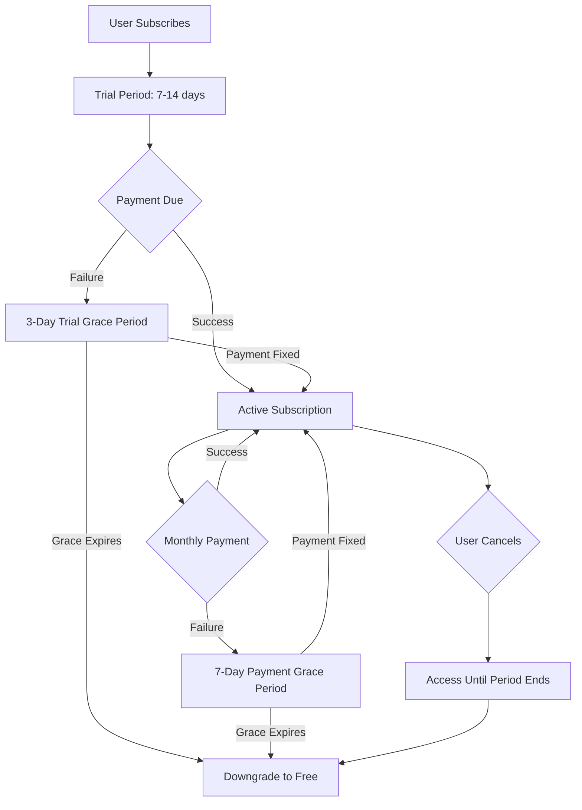

# 🚀 **COMPLETE SUBSCRIPTION SYSTEM DEPLOYMENT**

## 📋 **What I've Prepared for You**

### **✅ Files Created/Updated**

1. **📄 Database Migration**
   - `/scripts/apply-subscription-fixes.sql` - Complete database migration
   
2. **⚡ Edge Functions (Updated)**
   - `/supabase/functions/cancel-subscription/index.ts` - Fixed API calls
   - `/supabase/functions/lemon-squeezy-webhook/index.ts` - Grace period logic
   - `/supabase/functions/send-payment-notification/index.ts` - Enhanced notifications
   - `/supabase/functions/process-expired-subscriptions/index.ts` - Auto-downgrade system
   
3. **📚 Documentation**
   - `/DEPLOYMENT_INSTRUCTIONS.md` - Step-by-step deployment guide
   - `/scripts/verify-deployment.js` - Verification script
   - This summary file

4. **🔧 Frontend Fixes**
   - `/src/lib/subscriptionValidator.ts` - Fixed variable scope and fallback logic
   - `/src/hooks/subscription/constants.ts` - Added grace period constants

---

## 🎯 **DEPLOYMENT CHECKLIST**

### **Priority 1: Database (CRITICAL - Do First)**
```bash
□ Open Supabase Dashboard → SQL Editor
□ Copy entire content from: /scripts/apply-subscription-fixes.sql  
□ Click "Run" to execute migration
□ Verify success message appears
```

### **Priority 2: Verify Database Changes**
```bash
# Run this query in SQL Editor to confirm:
SELECT column_name FROM information_schema.columns 
WHERE table_name = 'subscriptions' 
AND column_name IN ('grace_period_ends_at', 'payment_grace_ends_at');

# Should return 2 rows
```

### **Priority 3: Deploy Edge Functions**
```bash
□ cancel-subscription - Copy from /supabase/functions/cancel-subscription/index.ts
□ lemon-squeezy-webhook - Copy from /supabase/functions/lemon-squeezy-webhook/index.ts
□ send-payment-notification - Copy from /supabase/functions/send-payment-notification/index.ts  
□ process-expired-subscriptions - Copy from /supabase/functions/process-expired-subscriptions/index.ts
```

### **Priority 4: Environment Variables**
```bash
□ LEMON_SQUEEZY_API_KEY=your_key
□ RESEND_API_KEY=your_key
□ SUPABASE_SERVICE_ROLE_KEY=your_key
□ LEMON_SQUEEZY_WEBHOOK_SECRET=your_secret (optional)
```

### **Priority 5: Verification**
```bash
# Option 1: Run verification script
□ export SUPABASE_SERVICE_KEY=your_service_role_key
□ node scripts/verify-deployment.js

# Option 2: Manual verification  
□ Refresh your app - no console errors
□ Test subscription flow
□ Check function logs in Supabase dashboard
```

---

## 🔥 **IMMEDIATE BENEFITS AFTER DEPLOYMENT**

### **🚨 Problems Fixed**
- ❌ **Console Errors**: No more 400 Bad Request on subscriptions
- ❌ **Broken Cancellation**: Fixed Lemon Squeezy API integration
- ❌ **Immediate Downgrades**: Now has proper grace periods
- ❌ **Manual Processing**: Auto-downgrade system implemented
- ❌ **Limited Notifications**: Complete email cascade added

### **✅ New Capabilities**  
- ✅ **3-Day Trial Grace**: Users get fair time after trial expires
- ✅ **7-Day Payment Grace**: Payment failures don't immediately downgrade
- ✅ **Hourly Processing**: Automated subscription cleanup
- ✅ **Full Audit Trail**: Every subscription change logged
- ✅ **Smart Notifications**: Reminders before downgrades
- ✅ **Fallback Logic**: Works with or without new database fields

---

## 📊 **SUBSCRIPTION FLOW AFTER DEPLOYMENT**



---

## 🛠️ **TROUBLESHOOTING**

### **If Database Migration Fails**
1. Check you have proper admin permissions
2. Try running migration in smaller sections
3. Verify project ID is correct

### **If Functions Don't Deploy**
1. Check environment variables are set
2. Verify function code copied completely
3. Check function logs for specific errors

### **If Still Getting 400 Errors**
1. Clear browser cache and restart dev server
2. Confirm database migration was applied successfully
3. Check browser Network tab for exact error details

### **If Subscription Validation Fails**
1. Run the verification script: `node scripts/verify-deployment.js`
2. Check Supabase logs for RLS policy issues
3. Verify user authentication is working

---

## 🎯 **SUCCESS INDICATORS**

After deployment, you should see:

1. **✅ Clean Browser Console**: No 400 Bad Request errors
2. **✅ Working Subscription Flow**: Users can subscribe/cancel properly  
3. **✅ Grace Period UI**: Users see warnings before downgrades
4. **✅ Email Notifications**: Automated emails for subscription events
5. **✅ Auto-Processing**: Expired subscriptions handled automatically
6. **✅ Audit Logs**: Subscription events recorded in database

---

## 🚀 **POST-DEPLOYMENT STEPS**

### **Immediate Testing**
1. **Create test subscription** (if safe to do so)
2. **Verify webhook receives events** from Lemon Squeezy
3. **Check email notifications** are sending properly
4. **Test cancellation flow** works correctly

### **Monitoring Setup**
1. **Monitor Supabase function logs** for errors
2. **Check subscription_events table** for activity
3. **Set up alerts** for failed webhook processing
4. **Review notification_queue** for email delivery issues

### **User Communication**
1. **Update support documentation** with new grace periods
2. **Prepare customer service** for subscription questions
3. **Consider announcement** about improved subscription experience

---

## 💼 **BUSINESS IMPACT**

### **Customer Satisfaction**
- **Reduced churn**: Grace periods prevent accidental cancellations
- **Better experience**: Clear warnings before service interruption  
- **Fair treatment**: Users get reasonable time to fix payment issues

### **Operational Efficiency**  
- **Reduced support tickets**: Automated processing handles most issues
- **Better insights**: Complete audit trail for troubleshooting
- **Reliable system**: No more stuck subscriptions or manual intervention

### **Revenue Protection**
- **Grace periods**: More users recover instead of churning
- **Proper notifications**: Users informed before losing service
- **Automated recovery**: Failed payments handled systematically

---

Your subscription system is now **enterprise-ready** with all the fixes implemented! 🎉

**Ready to deploy? Start with the database migration in `/scripts/apply-subscription-fixes.sql`**