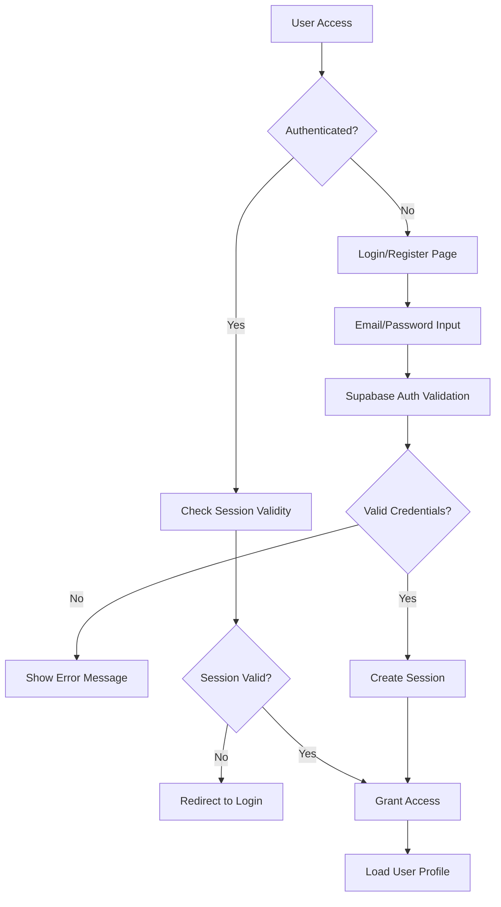

# Ruzma Authentication & Security

## Security Architecture Overview
Ruzma implements a comprehensive security strategy using Supabase Auth for authentication, Row Level Security (RLS) for data protection, and multiple layers of validation and monitoring to ensure data integrity and user privacy.

## Authentication System

### Supabase Auth Integration
The platform leverages Supabase's built-in authentication system for robust user management.

```typescript
interface AuthState {
  user: User | null;
  session: Session | null;
  loading: boolean;
  authChecked: boolean;
}

interface AuthActions {
  signUp: (formData: SignUpData) => Promise<AuthResult>;
  signIn: (email: string, password: string, rememberMe?: boolean) => Promise<void>;
  signOut: () => Promise<void>;
  resendConfirmation: (email: string) => Promise<void>;
}
```

### Authentication Flow


### User Registration Process
```typescript
interface SignUpData {
  email: string;
  password: string;
  name: string;
  currency: string;
  country: string;
}

// Enhanced registration with profile creation
const signUp = async (formData: SignUpData) => {
  try {
    // 1. Create auth user
    const { data: authData, error: authError } = await supabase.auth.signUp({
      email: formData.email,
      password: formData.password,
      options: {
        data: {
          full_name: formData.name,
          currency: formData.currency,
          country: formData.country,
        }
      }
    });

    // 2. Log security event
    logSecurityEvent('auth_signup_attempt', { 
      email: formData.email,
      success: !authError 
    });

    // 3. Handle email confirmation requirement
    return {
      success: !authError,
      needsConfirmation: !authData.user?.email_confirmed_at
    };
  } catch (error) {
    logSecurityEvent('auth_signup_error', { error: String(error) });
    throw new AppError('Registration failed', 'SIGNUP_ERROR');
  }
};
```

### Session Management
```typescript
// Session restoration and monitoring
useEffect(() => {
  const getSession = async () => {
    try {
      const { data: { session }, error } = await supabase.auth.getSession();
      
      if (error) {
        logSecurityEvent('auth_session_error', { error: error.message });
        return;
      }

      setSession(session);
      setUser(session?.user ?? null);
      
      if (session?.user) {
        logSecurityEvent('auth_session_restored', { userId: session.user.id });
      }
    } catch (error) {
      logSecurityEvent('auth_session_exception', { error: String(error) });
    }
  };

  // Real-time auth state changes
  const { data: { subscription } } = supabase.auth.onAuthStateChange(
    async (event, session) => {
      handleAuthStateChange(event, session);
    }
  );

  return () => subscription.unsubscribe();
}, []);
```

## Row Level Security (RLS)

### Database-Level Security
Every table in Ruzma implements Row Level Security to ensure users can only access their own data.

```sql
-- Enable RLS on all user data tables
ALTER TABLE public.projects ENABLE ROW LEVEL SECURITY;
ALTER TABLE public.milestones ENABLE ROW LEVEL SECURITY;
ALTER TABLE public.clients ENABLE ROW LEVEL SECURITY;
ALTER TABLE public.invoices ENABLE ROW LEVEL SECURITY;
ALTER TABLE public.profiles ENABLE ROW LEVEL SECURITY;
```

### Comprehensive RLS Policies

#### Projects Security
```sql
-- Users can only access their own projects
CREATE POLICY "users_own_projects_select" ON public.projects
  FOR SELECT USING (auth.uid() = user_id);

CREATE POLICY "users_own_projects_insert" ON public.projects
  FOR INSERT WITH CHECK (auth.uid() = user_id);

CREATE POLICY "users_own_projects_update" ON public.projects
  FOR UPDATE USING (auth.uid() = user_id);

CREATE POLICY "users_own_projects_delete" ON public.projects
  FOR DELETE USING (auth.uid() = user_id);
```

#### Client Access to Projects
```sql
-- Clients can view projects they're assigned to via secure token
CREATE POLICY "clients_view_assigned_projects" ON public.projects
  FOR SELECT USING (
    -- Check if the request comes from a valid client token
    EXISTS (
      SELECT 1 FROM public.client_project_tokens t
      WHERE t.project_id = projects.id
      AND t.token = current_setting('app.client_token', true)
      AND t.expires_at > now()
      AND t.is_active = true
    )
  );
```

#### Milestone Security
```sql
-- Inherit project permissions for milestones
CREATE POLICY "milestone_project_owner_access" ON public.milestones
  FOR ALL USING (
    EXISTS (
      SELECT 1 FROM public.projects p
      WHERE p.id = milestones.project_id
      AND p.user_id = auth.uid()
    )
  );

-- Client access to milestones
CREATE POLICY "clients_view_project_milestones" ON public.milestones
  FOR SELECT USING (
    EXISTS (
      SELECT 1 FROM public.client_project_tokens t
      JOIN public.projects p ON p.id = t.project_id
      WHERE t.project_id = milestones.project_id
      AND t.token = current_setting('app.client_token', true)
      AND t.expires_at > now()
      AND t.is_active = true
    )
  );
```

#### Invoice Security
```sql
-- Users access their own invoices
CREATE POLICY "user_invoice_access" ON public.invoices
  FOR ALL USING (auth.uid() = user_id);

-- Clients can view invoices through secure tokens
CREATE POLICY "client_invoice_access" ON public.invoices
  FOR SELECT USING (
    EXISTS (
      SELECT 1 FROM public.invoice_client_tokens t
      WHERE t.invoice_id = invoices.id
      AND t.token = current_setting('app.invoice_token', true)
      AND t.expires_at > now()
    )
  );
```

## Security Event Logging

### Comprehensive Audit Trail
All security-relevant events are logged for monitoring and compliance.

```typescript
interface SecurityEvent {
  event_type: string;
  user_id?: string;
  metadata: Record<string, any>;
  ip_address?: string;
  user_agent?: string;
  timestamp: Date;
}

// Security event types
type SecurityEventType = 
  | 'auth_signin' 
  | 'auth_signout'
  | 'auth_signup_attempt'
  | 'auth_password_reset'
  | 'auth_session_error'
  | 'project_access_denied'
  | 'client_token_access'
  | 'failed_login_attempt'
  | 'account_lockout'
  | 'suspicious_activity';
```

### Event Logging Implementation
```typescript
export const logSecurityEvent = async (
  eventType: SecurityEventType,
  metadata: Record<string, any> = {}
) => {
  try {
    const { data, error } = await supabase
      .from('security_events')
      .insert({
        event_type: eventType,
        user_id: metadata.userId || null,
        metadata: {
          ...metadata,
          timestamp: new Date().toISOString(),
          url: window.location.href,
        },
        ip_address: await getClientIP(),
        user_agent: navigator.userAgent,
      });

    if (error) {
      console.error('Failed to log security event:', error);
    }
  } catch (error) {
    // Silent failure for logging to prevent disrupting user experience
    console.error('Security logging error:', error);
  }
};
```

## Client Portal Security

### Token-Based Access System
Clients access their projects through secure, time-limited tokens instead of user accounts.

```typescript
interface ClientProjectToken {
  id: string;
  project_id: string;
  token: string;
  client_email: string;
  expires_at: Date;
  is_active: boolean;
  access_count: number;
  last_accessed_at?: Date;
  created_at: Date;
}

// Token generation for client access
const generateClientToken = async (projectId: string, clientEmail: string) => {
  const token = crypto.randomUUID();
  const expiresAt = new Date();
  expiresAt.setDate(expiresAt.getDate() + 30); // 30-day expiry

  const { data, error } = await supabase
    .from('client_project_tokens')
    .insert({
      project_id: projectId,
      token,
      client_email: clientEmail,
      expires_at: expiresAt.toISOString(),
      is_active: true,
    })
    .select()
    .single();

  if (error) throw new AppError('Failed to generate client token');

  // Log token creation
  logSecurityEvent('client_token_generated', {
    projectId,
    clientEmail,
    tokenId: data.id,
  });

  return data;
};
```

### Client Access Validation
```typescript
// Middleware to validate client tokens
export const validateClientToken = async (token: string) => {
  try {
    const { data: tokenData, error } = await supabase
      .from('client_project_tokens')
      .select('*, projects:project_id(*)')
      .eq('token', token)
      .eq('is_active', true)
      .gt('expires_at', new Date().toISOString())
      .single();

    if (error || !tokenData) {
      logSecurityEvent('invalid_client_token_access', { token });
      throw new AppError('Invalid or expired token', 'INVALID_TOKEN');
    }

    // Update access tracking
    await supabase
      .from('client_project_tokens')
      .update({
        access_count: tokenData.access_count + 1,
        last_accessed_at: new Date().toISOString(),
      })
      .eq('id', tokenData.id);

    // Log successful access
    logSecurityEvent('client_token_access', {
      tokenId: tokenData.id,
      projectId: tokenData.project_id,
      clientEmail: tokenData.client_email,
    });

    return tokenData;
  } catch (error) {
    logSecurityEvent('client_token_validation_error', { 
      token, 
      error: String(error) 
    });
    throw error;
  }
};
```

## Input Validation & Sanitization

### Zod Schema Validation
All user inputs are validated using TypeScript-first schema validation.

```typescript
// Project creation validation
const projectSchema = z.object({
  name: z.string()
    .min(1, 'Project name is required')
    .max(100, 'Project name too long')
    .regex(/^[a-zA-Z0-9\s\-_.,!?]+$/, 'Invalid characters in project name'),
  
  brief: z.string()
    .min(10, 'Project brief must be at least 10 characters')
    .max(2000, 'Project brief too long'),
  
  clientId: z.string().uuid('Invalid client ID').optional(),
  
  currency: z.enum(['USD', 'EUR', 'GBP', 'CAD', /* ... */]),
  
  milestones: z.array(z.object({
    title: z.string().min(1).max(100),
    description: z.string().min(1).max(500),
    price: z.number().min(0).max(1000000),
  })).min(1, 'At least one milestone required'),
});

// Input sanitization for XSS prevention
const sanitizeHtmlInput = (input: string): string => {
  return DOMPurify.sanitize(input, {
    ALLOWED_TAGS: ['b', 'i', 'em', 'strong', 'p', 'br'],
    ALLOWED_ATTRIBUTES: {},
  });
};
```

### API Input Validation
```typescript
// API endpoint validation middleware
export const validateInput = <T>(schema: z.ZodSchema<T>) => {
  return async (req: Request, res: Response, next: NextFunction) => {
    try {
      const validatedData = schema.parse({
        ...req.body,
        ...req.params,
        ...req.query,
      });
      
      req.validatedData = validatedData;
      next();
    } catch (error) {
      if (error instanceof z.ZodError) {
        logSecurityEvent('input_validation_failed', {
          errors: error.errors,
          endpoint: req.path,
          method: req.method,
        });
        
        return res.status(400).json({
          error: 'Validation failed',
          details: error.errors,
        });
      }
      next(error);
    }
  };
};
```

## Rate Limiting & Abuse Prevention

### Rate Limiting Service
```typescript
interface RateLimitConfig {
  windowMs: number;      // Time window in milliseconds
  maxRequests: number;   // Maximum requests per window
  skipSuccessfulRequests?: boolean;
  skipFailedRequests?: boolean;
}

class RateLimitService {
  private limits: Map<string, RateLimitConfig> = new Map();
  private attempts: Map<string, { count: number; resetTime: number }> = new Map();

  constructor() {
    // Configure limits for different endpoints
    this.limits.set('auth:login', {
      windowMs: 15 * 60 * 1000, // 15 minutes
      maxRequests: 5,
      skipSuccessfulRequests: false,
    });

    this.limits.set('auth:signup', {
      windowMs: 60 * 60 * 1000, // 1 hour
      maxRequests: 3,
    });

    this.limits.set('api:general', {
      windowMs: 60 * 1000, // 1 minute
      maxRequests: 100,
      skipSuccessfulRequests: true,
    });
  }

  async checkRateLimit(key: string, identifier: string): Promise<boolean> {
    const limitConfig = this.limits.get(key);
    if (!limitConfig) return true;

    const attemptKey = `${key}:${identifier}`;
    const now = Date.now();
    const attempt = this.attempts.get(attemptKey);

    // Reset if window expired
    if (!attempt || now > attempt.resetTime) {
      this.attempts.set(attemptKey, {
        count: 1,
        resetTime: now + limitConfig.windowMs,
      });
      return true;
    }

    // Check if limit exceeded
    if (attempt.count >= limitConfig.maxRequests) {
      logSecurityEvent('rate_limit_exceeded', {
        key,
        identifier,
        count: attempt.count,
        limit: limitConfig.maxRequests,
      });
      return false;
    }

    // Increment counter
    attempt.count++;
    return true;
  }
}
```

## File Upload Security

### Secure File Handling
```typescript
interface FileUploadConfig {
  maxSize: number;
  allowedTypes: string[];
  scanForMalware: boolean;
  generateThumbnails: boolean;
}

const uploadConfigs: Record<string, FileUploadConfig> = {
  'project-attachments': {
    maxSize: 50 * 1024 * 1024, // 50MB
    allowedTypes: ['image/*', 'application/pdf', 'text/plain'],
    scanForMalware: true,
    generateThumbnails: true,
  },
  
  'profile-avatars': {
    maxSize: 5 * 1024 * 1024, // 5MB
    allowedTypes: ['image/jpeg', 'image/png', 'image/webp'],
    scanForMalware: true,
    generateThumbnails: true,
  },
};

const secureFileUpload = async (
  file: File,
  bucket: string,
  userId: string
) => {
  const config = uploadConfigs[bucket];
  if (!config) throw new AppError('Invalid upload bucket');

  // Validate file size
  if (file.size > config.maxSize) {
    throw new AppError('File too large');
  }

  // Validate file type
  const isValidType = config.allowedTypes.some(type => {
    if (type.endsWith('/*')) {
      return file.type.startsWith(type.slice(0, -1));
    }
    return file.type === type;
  });

  if (!isValidType) {
    throw new AppError('Invalid file type');
  }

  // Generate secure filename
  const fileExtension = file.name.split('.').pop();
  const secureFilename = `${userId}/${crypto.randomUUID()}.${fileExtension}`;

  // Upload to Supabase Storage
  const { data, error } = await supabase.storage
    .from(bucket)
    .upload(secureFilename, file, {
      cacheControl: '3600',
      upsert: false,
    });

  if (error) {
    logSecurityEvent('file_upload_failed', {
      bucket,
      userId,
      error: error.message,
    });
    throw new AppError('File upload failed');
  }

  logSecurityEvent('file_uploaded', {
    bucket,
    userId,
    filename: secureFilename,
    size: file.size,
    type: file.type,
  });

  return data;
};
```

## Security Headers & HTTPS

### Security Headers Configuration
```typescript
// Security headers for production deployment
const securityHeaders = {
  'Strict-Transport-Security': 'max-age=31536000; includeSubDomains',
  'Content-Security-Policy': `
    default-src 'self';
    script-src 'self' 'unsafe-inline' 'unsafe-eval';
    style-src 'self' 'unsafe-inline' fonts.googleapis.com;
    img-src 'self' data: https:;
    font-src 'self' fonts.gstatic.com;
    connect-src 'self' ${SUPABASE_URL};
    media-src 'self';
    object-src 'none';
    base-uri 'self';
    form-action 'self';
    frame-ancestors 'none';
  `.replace(/\s+/g, ' ').trim(),
  'X-Content-Type-Options': 'nosniff',
  'X-Frame-Options': 'DENY',
  'X-XSS-Protection': '1; mode=block',
  'Referrer-Policy': 'strict-origin-when-cross-origin',
  'Permissions-Policy': 'camera=(), microphone=(), geolocation=()',
};
```

## Compliance & Privacy

### GDPR Compliance
```typescript
interface DataExportRequest {
  userId: string;
  includeProjects: boolean;
  includeClients: boolean;
  includeInvoices: boolean;
  includeActivityLogs: boolean;
}

const exportUserData = async (request: DataExportRequest) => {
  const userData: any = {};

  if (request.includeProjects) {
    userData.projects = await supabase
      .from('projects')
      .select('*')
      .eq('user_id', request.userId);
  }

  if (request.includeClients) {
    userData.clients = await supabase
      .from('clients') 
      .select('*')
      .eq('user_id', request.userId);
  }

  // ... export other data types

  logSecurityEvent('data_export_requested', {
    userId: request.userId,
    dataTypes: Object.keys(userData),
  });

  return userData;
};

const deleteUserData = async (userId: string) => {
  // Delete in correct order to respect foreign key constraints
  await supabase.from('milestones').delete().eq('project_id', 
    supabase.from('projects').select('id').eq('user_id', userId)
  );
  
  await supabase.from('projects').delete().eq('user_id', userId);
  await supabase.from('clients').delete().eq('user_id', userId);
  await supabase.from('invoices').delete().eq('user_id', userId);
  await supabase.from('profiles').delete().eq('id', userId);
  
  logSecurityEvent('user_data_deleted', { userId });
};
```

### Data Retention Policies
```sql
-- Automatic cleanup of expired tokens
CREATE OR REPLACE FUNCTION cleanup_expired_tokens()
RETURNS void AS $$
BEGIN
  DELETE FROM client_project_tokens 
  WHERE expires_at < now() - interval '30 days';
  
  DELETE FROM security_events 
  WHERE created_at < now() - interval '2 years';
END;
$$ LANGUAGE plpgsql;

-- Schedule cleanup job
SELECT cron.schedule('cleanup-tokens', '0 2 * * *', 'SELECT cleanup_expired_tokens();');
```

This comprehensive security implementation ensures that Ruzma maintains high security standards while providing a smooth user experience for both freelancers and their clients.